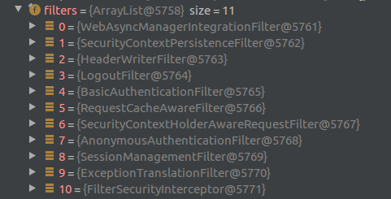

# Spring Security Architecture

Spring Security自定义Servlet Filter --- **FilterChainProxy**作为整个Spring Security的入口, 
通过DelegatingFilterProxy将以***springSecurityFilterChain***命名的FilterChainProxy注入, 
同Spring Boot进行集成.


## Spring Security Filter

FilterChainProxy作为Spring Security入口, 
在其内部又维护了多个过滤链(SecurityFilterChain),
每个过滤链通过对请求进行规则匹配(RequestMatcher), 
然后按顺序执行多个配置的过滤器.


SecurityFilterChain中默认的11个过滤器有以下这些:



### Spring Security 配置

可以通过WebSecurityConfigurerAdapter对Spring Security进行配置.

```java
public abstract class WebSecurityConfigurerAdapter implements
		WebSecurityConfigurer<WebSecurity> {

    /**
     *  通过AuthenticationManagerBuilder对认证进行配置
     *  详见认证的章节
     */
    protected void configure(AuthenticationManagerBuilder auth) throws Exception {
    }

    /**
     *  通过HttpSecurity对SecurityFilterChain进行构建
     *  例如：
     *      - 配置SecurityFilterChain用于哪些请求
     *      - 配置内部的Filter链
     *      - 配置哪些请求需要认证， 哪些不需要
     */
    protected void configure(HttpSecurity http) throws Exception {
    }

    /**
     *  通过WebSecurity对SecurityFilterChain进行配置
     *  例如：
     *      - 忽略某些请求
     */
    public void configure(WebSecurity web) throws Exception {
    }
}
```

## SecurityContextPersistenceFilter

通过SecurityContextRepository获取和保存SecurityContext, 
SecurityContext中保存了登录的账户信息.

SecurityContextPersistenceFilter会初始化SecurityContextHolder, 
为后续的Filter提供SecurityContext的支持, 
默认SecurityContext是保存在ThreadLocal中, 
即在当前请求的处理链中都可以通过SecurityContextHolder访问到.


## HeaderWriterFilter

将**安全相关的头信息**添加到请求头或回复头中

- Cache-Control头信息
- X-Frame-Options头信息
- X-XSS-Protection头信息

## LogoutFilter

对指定的登出请求URL进行处理, 将账户登出并清理相关的信息

- 清理Cookie
- 清理登录的账户信息

## 认证(Authentication)相关的Filer

通过AuthenticationManager对登录用户进行认证, 成功后将保存Authentication(认证信息)到SecurityContext中.

- 当前SecurityFilterChain中使用的AuthenticationManager
- 全局的AuthenticationManager, 当SecurityFilterChain中的AuthenticationManager无法认证时, 则会用到它


可以为一个AuthenticationManager配置多个AuthenticationProvider, 通过一定的策略来对账户信息进行认证.

详情会在认证章节讲解.

## ExceptionTranslationFilter

捕获SecurityFilterChain中产生的**未捕获**的AuthenticationException/AccessDeniedException错误


- AuthenticationEntryPoint用于处理AuthenticationException相关的认证失败错误, 然后交由ErrorController处理
- AccessDeniedHandler用于处理AccessDeniedException相关的鉴权失败错误, 然后交由ErrorController处理
- ErrorController是容器级的统一处理错误的地方

## FilterSecurityInterceptor

对预先配置好权限的请求的进行鉴权.

通过**AccessDecisionManager**来遍历AccessDecisionVoter对请求进行鉴权(Authorization)处理

通常会使用Spring Expression Language (SpEL)来描述ConfigAttribute


详情会在鉴权章节讲解.

## Reference

- [Architecture Document](https://spring.io/guides/topicals/spring-security-architecture/)