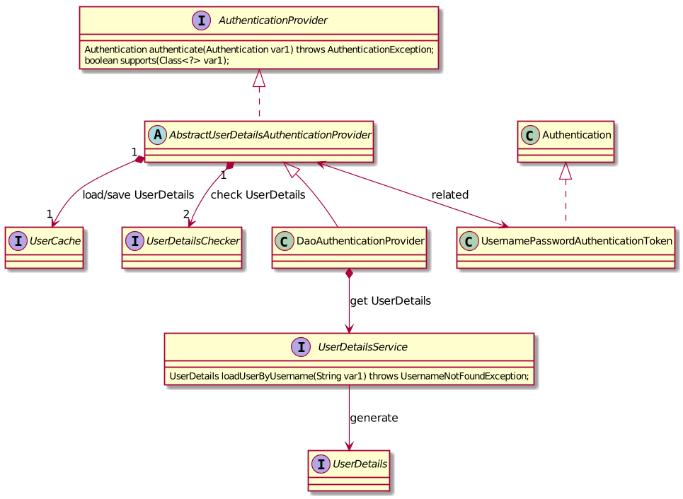

# Spring Security --- Authentication

可以为每一个SecurityFilterChain配置多种不同的认证方式, 
默认BasicAuthenticationFilter可以支持http的basic认证方式

通过**WebSecurityConfigurerAdapter#configure(AuthenticationManagerBuilder auth)**
进行认证配置.

核心元素
- 用于Authentication的Filter, 包含完整的认证处理的逻辑, 例如BasicAuthenticationFilter
- **Authentication**, 保存认证相关的信息
- AuthenticationManager接口, 认证处理的入口, 用于获取认证通过的Authentication信息
- **AuthenticationProvider**, 处理指定认证方式的处理器
- ProviderManager, 它是SpringSecurity提供的AuthenticationManager的默认实现, 
维护有多个AuthenticationProvider, 用于支持多种不同的认证方式

## Spring Security的Authentication架构

- UserDetails, 包含所需要的用户信息以及权限信息
- UserDetailsService, 通过对应的唯一键(用户名/手机号等)获取UserDetails
- DaoAuthenticationProvider, 可以通过继承它来实现特定的认证方式

## 常用的Http认证方式

- [Basic][Http Basic Authentication]
- Digest
- Hawk
- [OAuth2][OAuth 2.0]
- OpenId

### Basic

Basic认证通过核对用户名和密码来进行身份认证.

核心元素:
- username
- password
- realm

在header中提供`Authorization: Basic base64(<username>:<password>)`

### OAuth2

OAuth的核心就是向第三方应用颁发令牌, 
第三方应用都必须先在系统中**申请client_id和client_secret**.

四种模式:

- 授权码(authorization-code), response_type=code, grant_type=authorization_code,
用户是在跳转到授权服务的页面时才输入账户信息进行登录, 登录成功后跳转回原应用, 
安全性最高, 用于有后端服务的应用
- 隐藏式(implicit), response_type=token, 用于没有后端的应用, 直接向前端颁发令牌, 
令牌的位置是URL锚点(fragment, 以#表示), 而不是querystring.
浏览器跳转时，锚点不会发到服务器，就减少了泄漏令牌的风险
- 密码式(password), grant_type=password, 
用户直接在应用中输入账户信息, 然后由应用发送到授权服务进行登录, 直接获取到token.
用于用户高度信任的应用.
- 客户端凭证(client credentials), grant_type=client_credentials, 
用于没有前端的命令行应用, 直接获得该应用的token, 而非用户token.

拿到token后, 通过Header里设置`Authorization: Bearer ACCESS_TOKEN`来访问资源.

## 令牌(Token)类型

在认证成功后, 后端往往会返回一个令牌给前端, 
之后前端就拿着这个令牌来访问资源.

- 透明令牌, 不包含用户信息, 在后端通过令牌来获取用户信息
  - Session in Cookie, cookie信息和指定的host相关联, 其他域不能使用
  - Bear Token, 通过Http Header进行传递
- 自签名令牌, 包含用户信息
  - JWT(JSON Web Token)

## Reference

- [Servlet Authentication](https://docs.spring.io/spring-security/site/docs/5.3.1.RELEASE/reference/html5/#servlet-authentication)
- [Http Basic Authentication](https://tools.ietf.org/html/rfc7617)
- [OAuth 2.0](https://tools.ietf.org/html/rfc6749)
- [OAuth 2.0 的四种方式](https://www.ruanyifeng.com/blog/2019/04/oauth-grant-types.html)
- [Spring Security OAuth2](https://projects.spring.io/spring-security-oauth/docs/oauth2.html)
